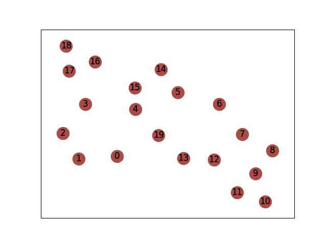
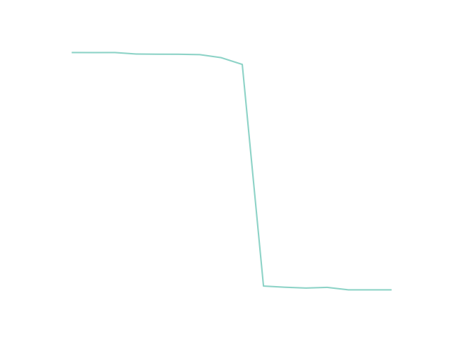

# Sprawozdanie 2

### Topologia sieci

### Macierz N
Nasza macierz $N$ jest opisana wzorem $n(i,j)=i$ mod $3 * INTENSITY$.
Bazowe $INTENSITY$ jest równe 400.
|0|400|800|0|400|800|0|400|800|0|400|800|0|400|800|0|400|800|0|400|
|-|---|---|-|---|---|-|---|---|-|---|---|-|---|---|-|---|---|-|---|
|0|0|800|0|400|800|0|400|800|0|400|800|0|400|800|0|400|800|0|400|
|0|400|0|0|400|800|0|400|800|0|400|800|0|400|800|0|400|800|0|400|
|0|400|800|0|400|800|0|400|800|0|400|800|0|400|800|0|400|800|0|400|
|0|400|800|0|0|800|0|400|800|0|400|800|0|400|800|0|400|800|0|400|
|0|400|800|0|400|0|0|400|800|0|400|800|0|400|800|0|400|800|0|400|
|0|400|800|0|400|800|0|400|800|0|400|800|0|400|800|0|400|800|0|400|
|0|400|800|0|400|800|0|0|800|0|400|800|0|400|800|0|400|800|0|400|
|0|400|800|0|400|800|0|400|0|0|400|800|0|400|800|0|400|800|0|400|
|0|400|800|0|400|800|0|400|800|0|400|800|0|400|800|0|400|800|0|400|
|0|400|800|0|400|800|0|400|800|0|0|800|0|400|800|0|400|800|0|400|
|0|400|800|0|400|800|0|400|800|0|400|0|0|400|800|0|400|800|0|400|
|0|400|800|0|400|800|0|400|800|0|400|800|0|400|800|0|400|800|0|400|
|0|400|800|0|400|800|0|400|800|0|400|800|0|0|800|0|400|800|0|400|
|0|400|800|0|400|800|0|400|800|0|400|800|0|400|0|0|400|800|0|400|
|0|400|800|0|400|800|0|400|800|0|400|800|0|400|800|0|400|800|0|400|
|0|400|800|0|400|800|0|400|800|0|400|800|0|400|800|0|0|800|0|400|
|0|400|800|0|400|800|0|400|800|0|400|800|0|400|800|0|400|0|0|400|
|0|400|800|0|400|800|0|400|800|0|400|800|0|400|800|0|400|800|0|400|
|0|400|800|0|400|800|0|400|800|0|400|800|0|400|800|0|400|800|0|0|

### Bazowe Parametry
$$p = 0.995$$
$$T_{max} = 0.003s$$
$$Capacity = 1Gb/s$$
$$Packet\_size = 1500B$$
$$Avg\_packet\_size = 8 * 1500 B = 12000b$$
Stosując metodę Monte Carlo dla $n = 100000$ iteracji, przy tych parametrach otrzymujemy niezawodność na poziomie ~$91.36$%.

### Zwiększanie natężenia
Tym razem będziemy stosować metodę Monte Carlo dla $n = 50000$. Nasze $INTESNITY$ będzie na początku
równe $100$, a inkrementować je będziemy o $50$ dopóki niezawodność nie spadnie do 0.

### Zwiększanie przepustowości
Te samą metodę Monte Carlo stosujemy dla przepustowości, przemnażając ją o współczynnik
w wartościach $0.6$ do $1.4$, inkrementując o $0.05$.\

### Dodawanie nowych krawędzi
Już po dodaniu 9 nowych krawędzi mamy 100% niezawodności. Ostatecznie nasz graf wygląda tak:\
\
A tu jest wykres:\

